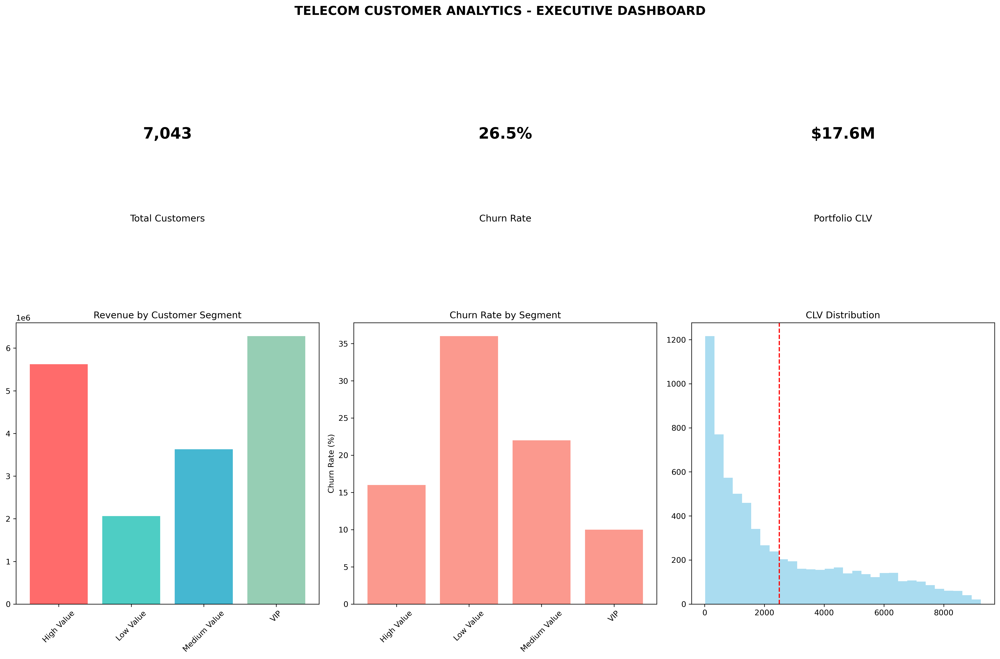

# 📊 Telecom Customer Churn & CLV Analysis

## 1. Project Overview
This is an **end-to-end data analytics project** that addresses the critical business challenge of **customer churn in the telecom industry**.  

The analysis spans **four weekly phases**, progressing from **data exploration** to a **business intelligence dashboard and strategic report**.  

The primary goals are:
- **Predict churn** using a machine learning model.
- **Quantify financial impact** through Customer Lifetime Value (CLV) analysis.
- **Provide actionable business recommendations**.

This project is designed as a **comprehensive portfolio piece** that demonstrates skills across:
- Data cleaning
- Exploratory Data Analysis (EDA)
- Predictive modeling
- Business reporting & dashboards  

---

## 2. Project Structure & Weekly Breakdown

### **Week 1: Data Loading & EDA**
- Load and clean raw customer dataset.  
- Perform **Exploratory Data Analysis (EDA)** to uncover initial insights.  
- Calculate **key metrics**: churn rate, average monthly revenue, average tenure.  

### **Week 2: Churn Prediction Modeling**
- Preprocess data for ML.  
- Train a **Random Forest Classifier** to predict churn.  
- Evaluate performance using **Accuracy** and **ROC AUC**.  
- Identify **top churn drivers**.  

### **Week 3: Customer Lifetime Value (CLV) Analysis**
- Calculate CLV per customer.  
- Segment customers into **value tiers** (e.g., VIP, High Value).  
- Quantify **total portfolio value** and **revenue at risk** due to churn.  

### **Week 4: Dashboard & Business Report**
- Build an **executive dashboard** to visualize key findings.  
- Generate a **strategic business report** with recommendations.  
- Provide **final project summary** highlighting business impact & ROI.  

---

## 3. Key Findings & Business Impact

- **High Churn Rate**: 26.5%, representing a major revenue loss.  
- **Contract Type Matters**: Month-to-month customers churn far more often.  
- **Financial Risk**: ~$2.86M in revenue is at risk due to churn.  
- **Predictive Power**: ML model achieves **77.9% accuracy**, enabling proactive retention.  
- **Customer Segmentation**: VIP customers average **$7,200 CLV**.  

---

## 4. How to Run This Project

### 4.1. Prerequisites
- Python **3.7+**  
- Jupyter Notebook / JupyterLab
- pandas
- numpy
- matplotlib
- seaborn
- plotly
- scikit-learn
- joblib
- 
## Dash Board

##  Insights Chart


### Install required libraries:
```bash
pip install pandas numpy matplotlib seaborn plotly scikit-learn joblib
Git Clone
```
## Git Clone :
```bash
git clone https://github.com/nishanthselvakumar1302/TELECOM-CUSTOMER-CHURN-CLV-ANALYSIS.git
cd TELECOM-CUSTOMER-CHURN-CLV-ANALYSIS

